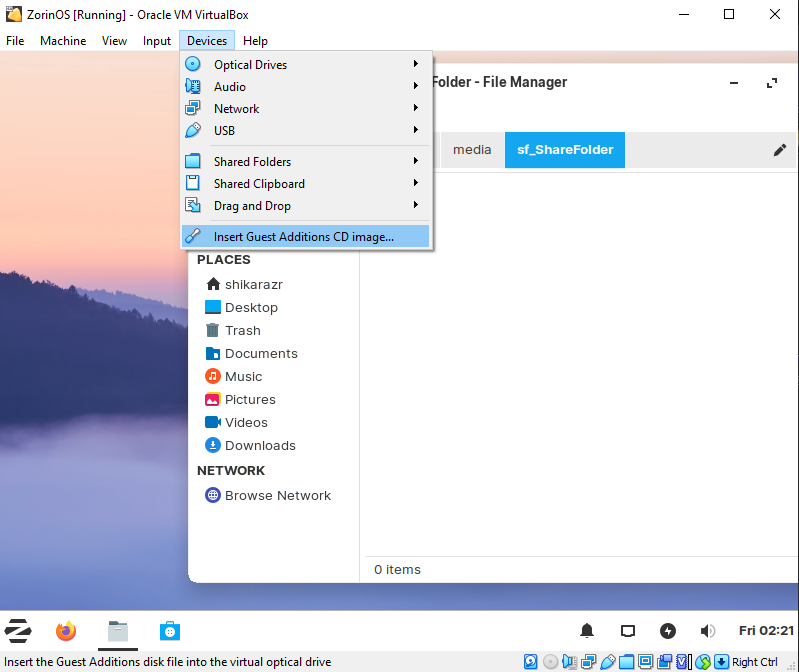

[Back to Commands & Resources](CommandsResources.md)

## Linux Commands
  https://lzone.de/cheat-sheet/DKMS

  https://linuxize.com/post/how-to-use-apt-command/

### Verify Linux Mint (Windows)

        certutil -hashfile .\linuxmint-22.3-cinnamon-64bit.iso SHA256

### Verify Arch Linux (Windows)
        Get-FileHash .\archlinux-2026.03.01-x86_64.iso -Algorithm SHA256

---

<details> 
  <summary>Install Linux Guest Additions</summary>
  

  - Device - Insert Guest Additions CD Image...
  - Go to disk and run:

        sudo ./VBoxLinuxAdditions.run
  - Give permissions to sharedfolder
  
        sudo adduser 'user' vboxsf
</details><br>
<details> 
        <summary>Install Linux on SSD With Virtual Machine</summary>
        
        
        
        
</details><br>

<details> 
  <summary>View Installed Packages (In date order)</summary>

  - ls -1t - get all dpkg.log* file names in chronological order
  - zcat -f - IF file is of gzip type then decompress it, ELSE just pass on the content.
  - tac - Reverse output of cat, line-by-line to makes sure we get the correct chronological order.
  - grep - Only check for installed or upgrade packages.
  - awk -F ':a' - Separate the architecture field from the package name
  - column -t - pretty print the columns separated by space
  - As shown above, it only works on ARM architecture and need slight modification for the architecture field separator 

        for x in $(ls -1t /var/log/dpkg.log*); do zcat -f $x |tac |grep -e " install " -e " upgrade "; done |awk -F ":a" '{print $1 " :a" $2}' |column -t
</details><br>


<details>
  <summary>Uninstall/Remove Unused/Orphaned Packages - apt autoremove deborphan</summary>

        apt-get remove packagename

> will remove the binaries, but not the configuration or data files of the package packagename. It will also leave dependencies installed with it on installation time untouched.

        "apt-get purge packagename" or "apt-get remove --purge packagename"

> will remove about everything regarding the package packagename, but not the dependencies installed with it on installation. Both commands are equivalent. <br>
particularly useful when you want to 'start all over' with an application because you messed up the configuration. However, it does not remove configuration or data files residing in users home directories, usually in hidden folders there. There is no easy way to get those removed as well.

        apt-get autoremove

> removes orphaned packages, i.e. installed packages that used to be installed as an dependency, but aren't any longer. Use this after removing a package which had installed dependencies you're no longer interested in.

        "aptitude remove packagename" or "aptitude purge packagename" (likewise)

> will also attempt to remove other packages which were required by packagename on but are not required by any remaining packages. Note that aptitude only remembers dependency information for packages that it has installed.
</details><br>


<details> 
  <summary>Security</summary>

 - Forum - https://forums.linuxmint.com/viewtopic.php?t=390000

 - Blog - https://easylinuxtipsproject.blogspot.com/p/security.html?m=1

 - Titus - https://youtu.be/QxNsyrftJ8I?si=cCUl6SgggGp9S0xE

 - General - https://youtu.be/Sa0KqbpLye4?si=eXpyoeV8ZrQd-n5u
</details><br>

<details> 
  <summary>Linux Mint</summary>

Start
- System Settings
- Disks
- Disk Usage Analyzer
- Update Manager
- Extensions
- Themes
- Firewall

Panel
- Mission Center
- System Monitor
- Terminal
- Nemo Folder
- Zen
- Software Manager
- VSCodium
- Steam
- Heroic Games Launcher

Installed
- Proton Plus
- ProtonUp
- Git
- OBS
- Avidemux (Allow Unverified Flatpack)
- VLC
- Pix

Windows
- Tiling - Maximize instead of tile

Sound
- Sounds - Tiling and snapping windows (off)

- Personal - Git (Login), Cmdrsrc (Bookmark, Wallpaper)
- Emergency Mode - Systemctl Default, Exit<br>
```journalctl -p err --since "20206-01-23" --until "2026-01-24" | less```<br>
```systemctl default```
- Install GPU Drivers

Scripts
Keyboard Shortcut Command
```
/home/shikarazr/window_screenshot_to_jpg.sh
```
.sh script
```
#!/bin/bash
gnome-screenshot -w -f "/home/shikarazr/Downloads/Screenshots/Screenshot-$(date +%Y-%m-%d_%H-%M-%S).jpg"
```

</details><br>

<details> 
  <summary>Arch Linux</summary>

Update System (-S sync -y refreshpackagedatabase -u updatepackages)
```
sudo pacman -Syu
```

Install package (After Updating)
```
sudo pacman -S firefox
```

Uninstall package (and no longer used dependencies)
```
sudo pacman -Rns firefox
```

List Orphaned Packages
```
sudo pacman -Qrdq
```

To enable multilib repository, uncomment the multilib section in /etc/pacman.conf
```
[multilib]
Include = /etc/pacman.d/mirrorlist
```

Install
- Zen (Flatpak)
- Mission Center (Flatpak)
- VSCodium (Flatpak)
- Obsidian (Flatpak)
- steam (multilib)
- gufw
- gnome-screenshot
- ProtonPlus (Downloader)
- ProtonUp-Qt (Downloader/Selector)

### GNOME DE 

Pins
- Settings
- System Monitor
- Console
- Files
- Disks
- Disk
- Usage Analyzer
- Tweaks
- Extensions
- Extension Manager
- Software

Extensions
- Apps Menu
- Dash to Panel
- Lockscreen Extension
- Vitals
- Blur my Shell

### Hyprland ML4W

Configuration
https://ml4w.com/os/getting-started/overview

After installing on arch, choosing the minimal profile
```
bash <(curl -s https://ml4w.com/os/stable) # Stable Release
```
After Reboot
```
start-hyprland
```
WelcomeSettings>DisplayManager>Activate SDDM

https://github.com/mylinuxforwork/hyprland-starter

```
The following custom key bindings are enabled (can be customized in ~/.config/hypr/hyprland.conf)

    SUPER + RETURN to start terminal
    SUPER + Q to quit an application
    SUPER + B to start browser
    SUPER + M to exit Hyprland
    SUPER + E to start filemanager
    SUPER + CTRL + RETURN to start launcher rofi
    SUPER + T to toggle floating
    SUPER + F to toggle fullscreen
    SUPER + 1-9 to switch workspaces
    more key bindings in ~/.config/hypr/conf/binds.conf
    SUPER + SHIFT + W to change wallpapers
    SUPER + CTRL + B to toggle waybar 
    SUPER + SHIFT + 1 - move workspace 
    SUPER + LEFT CLICK - move window 
    SUPER + RIGHT CLICK - stretch window
```
in ~/.config/hypr/keyboard.conf
```
sensitivity = -1.0
```
Fix cursor flicker (~/.config/hypr/keyboard.conf) (optional, at the bottom)
```
cursor:no_hardware_cursors = true
```
CTRL+TAB function remove (in ~/.config/hypr/conf/keybindings/defauilt.conf) (optional)
Add Comment
```
# bind = CTRL, Tab, exec...
```
Change SDDM Wallpaper - Welcome>settings>Display Manager>Copy Wallpaper to SDDM
Change Important Keybinds - Welcome>Dotfile Settings>System
Change Timeout (in ~/.config/hypr/hypridle.conf) things have to be typed in time order

### CachyOS
https://wiki.cachyos.org/
https://wiki.cachyos.org/installation/installation_prepare/
https://wiki.cachyos.org/configuration/secure_boot_setup/

</details><br>


<details> 
  <summary>Waydroid</summary>

[Waydroid Documentation](https://docs.waydro.id/usage/install-on-desktops)<br>
[Linux Mint Waydroid Setup](https://medium.com/@tony.j.miri/android-on-linux-mint-with-waydroid-setup-guide-ff0ca8eab22)<br>
[Waydroid Extras Script For Gaming](https://github.com/casualsnek/waydroid_script?tab=readme-ov-file)<br>
[Waydroid Resolution Change](https://docs.waydro.id/usage/waydroid-prop-options)<br>
[Waydroid Network Issues](https://docs.waydro.id/debugging/networking-issues)<br>

### Waydroid Install Commands

        sudo apt install curl ca-certificates -y
> curl certificates for safe connections to servers

        export DISTRO="jammy"
> version of Linux Mint - [jammy](https://www.linuxmint.com/download_all.php), create a persistent variable that holds our distro name

        sudo curl --proto '=https' --tlsv1.2 -Sf https://repo.waydro.id/waydroid.gpg --output /usr/share/keyrings/waydroid.gpg
> download a file on the internet in specified location in our local file system

        echo "deb [signed-by=/usr/share/keyrings/waydroid.gpg] https://repo.waydro.id/ $DISTRO main" | sudo tee /etc/apt/sources.list.d/waydroid.list
> add the new repository to our list of sources

        sudo apt update
> Update to use repository

        sudo apt install waydroid -y
> install waydroid

        sudo apt install weston
>install weston (optional) ONLY for distros that don't use wayland, <br> run weston then run waydroid

        waydroid first-launch
> launch waydroid (first time/afterwards too)

        waydroid show-full-ui
> launch waydroid

        waydroid session stop
> stop waydroid

<br><br>
### Waydroid Extras Script

    sudo apt install lzip
> required for script to run

    git clone https://github.com/casualsnek/waydroid_script
    cd waydroid_script
    python3 -m venv venv
    venv/bin/pip install -r requirements.txt
    sudo venv/bin/python3 main.py
> install/run script (~~gapps~~, libhoudini, magisk, smart dock)

<br><br>
### Granting full permission for apps data (HACK), combat against the apps permission issue on Android 11

    sudo waydroid shell
> run only when installing gacha game data (like arknights)

    chmod 777 -R /sdcard/Android
    chmod 777 -R /data/media/0/Android 
    chmod 777 -R /sdcard/Android/data
    chmod 777 -R /data/media/0/Android/obb 
    chmod 777 -R /mnt/*/*/*/*/Android/data
    chmod 777 -R /mnt/*/*/*/*/Android/obb
> permissions

<br><br>
### Waydroid Settings

> You can invert colors in Settings > Accessibility > Advanced/Color Inversion 

    waydroid prop set persist.waydroid.width 0-9999 (int)
    waydroid prop set persist.waydroid.height 0-9999 (int)
> Resolution

### Waydroid Network Requirements

    sudo ufw allow 53
    sudo ufw allow 67
    sudo ufw default allow FORWARD
    sudo systemctl restart ufw
> UFW/GUFW ports required for internet connection

    sudo ufw reset
    sudo ufw enable
    sudo ufw default reject
    sudo systemctl restart ufw
> ufw default
</details><br>


<details> 
  <summary>Gaming Compatibility/Fixes/Tools</summary>

Chris Titus Steam Games in Linux<br>
https://youtu.be/nRiUdVSeuFU?si=TunuhiYY77qRau-B<br>

Tools for Steam<br>
https://github.com/sonic2kk/steamtinkerlaunch<br>

Proton Tricks (Based on Wine Tricks)<br>
https://github.com/Matoking/protontricks<br>

ProtonUp-Qt (Install Wine/Proton compatibility tools like GE-Proton)<br>

Insurgency Error 
Game fails to start, 'GCC_7.0.0 not found', Ubuntu 22.04 <br>
https://steamcommunity.com/app/222880/discussions/3/3719440044266078799/ 

### Mangohud:
[Mangohud Video Guide](https://youtu.be/KSQrfWXHPDs?si=gR_LxBZxTbbpDYgV)<br>
FLATPAK XDG PORTAL FOR SYSTEM CONFIG

        sudo flatpak override --filesystem=xdg-config/MangoHud:ro

### Bottles:

Girls Frontline 2
```
wine-ge-proton8-26
dxvk-2.4.1
VKD3D disabled OR vkd3d-proton-2.14.1 (switch)

Installed_Dependencies:
d3dx9
msls31
arial32
times32
courie32
d3dcompiler_43
d3dcompiler_47
mono
gecko

renderer: gl
```
Run STALKER: ANOMALY 1.5.1 on Linux <br>ge-proton7-43<br>
https://steamcommunity.com/sharedfiles/filedetails/?id=2945494581<br>
https://www.reddit.com/r/linux_gaming/comments/tbanq8/stalker_anomaly_on_linux/<br>
https://github.com/DravenusRex/stalker-gamma-linux-guide<br>
https://www.youtube.com/watch?v=XBkl3rhgH8c<br>
```
ge-proton7-43
dxvk-2.4.1
vkd3d-proton-2.14.1

Installed_Dependencies:
d3dx9
msls31
arial32
times32
courie32
d3dcompiler_43
d3dcompiler_47
mono
gecko
d3dx11

renderer: gl
```
</details><br>


<details>
  <summary>Other Commands</summary>
  
        gnome-screenshot -a
> Gnome Screenshot - Snipping

**Touchpad Acceleration (There is no constant sensitivity, accel is the only sens)**

        xinput list
> Look for your touchpad id in the output (e.g., "SynPS/2 Synaptics TouchPad)

        xinput list-props <id>
> Display properties for your touchpad's ID

        xinput set-prop <id> "libinput Accel Speed" <value>
> \<value\> ranges from -1 (min accel) to 1 (max accel)


</details><br>


<details> 
  <summary>Disable Middle Mouse Click</summary>

1. Find your mouse ID

        xinput list
2. Check button mapping (Button 2 is the middle button.) (Output: 1 2 3 4 5 6 7)
        
        xinput get-button-map [ID]
3. Disable middle button
        
        xinput set-button-map 9 1 0 3 4 5 6 7
        xinput set-button-map 12 1 0 3 4 5 6 7

4. This resets after reboot.
</details><br>


